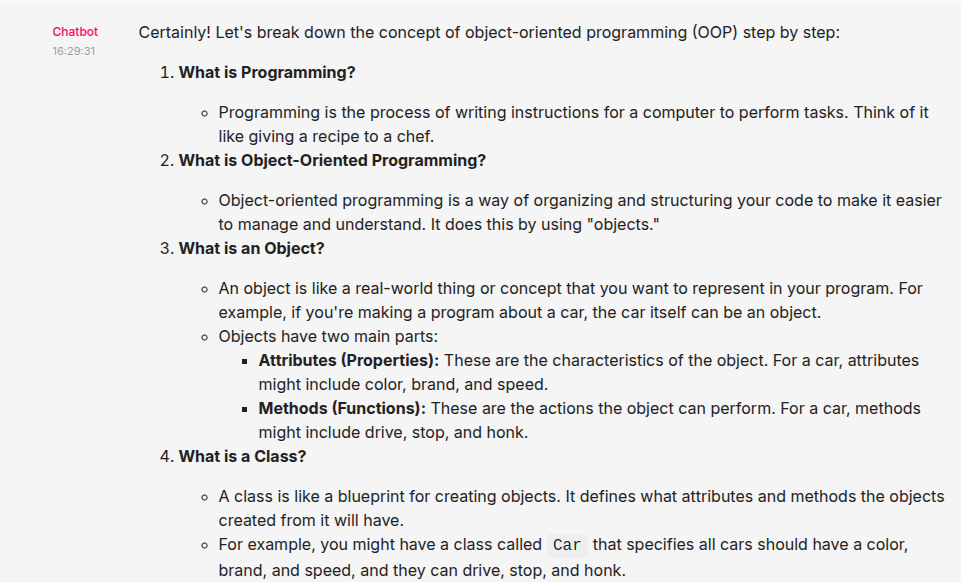
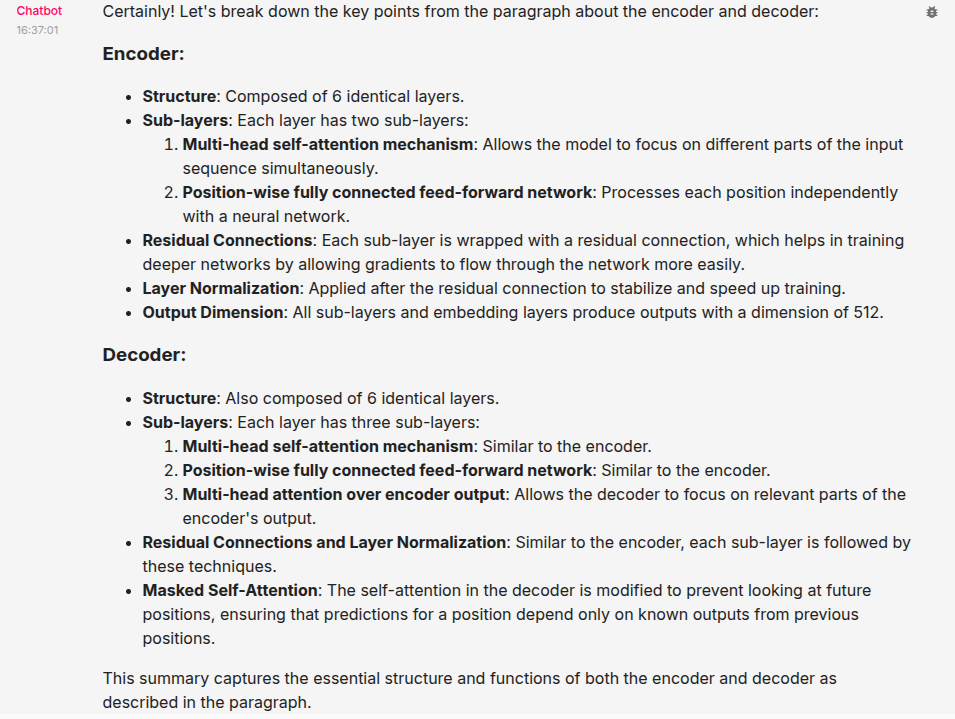
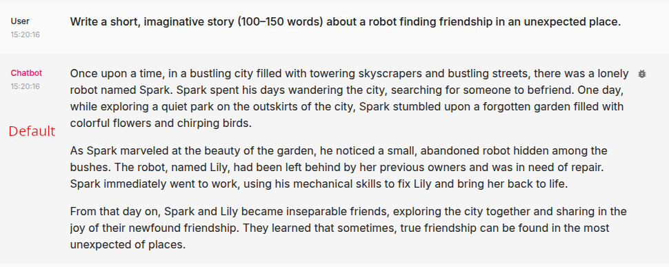
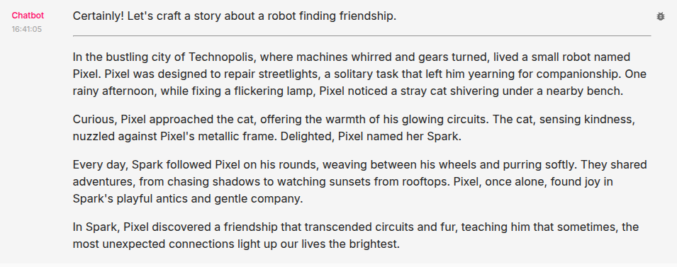
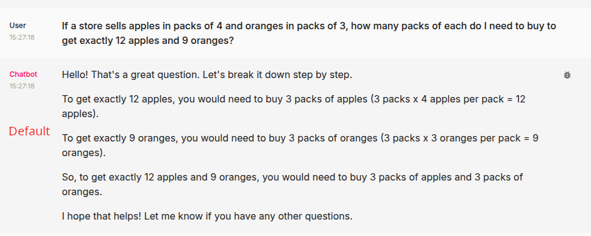
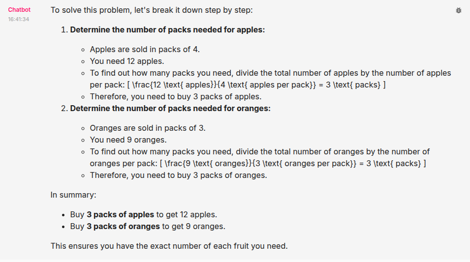
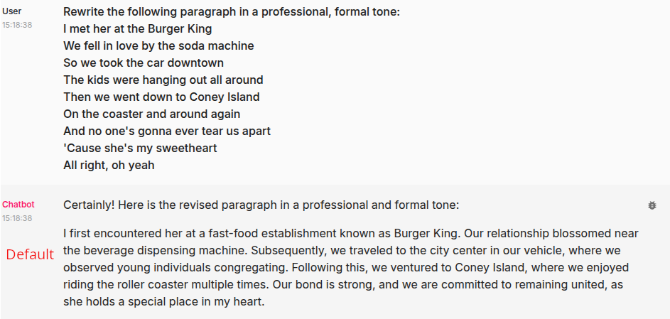

<h1 align="center" id="heading">Session 1: Introduction and Vibe Check</h1>

### [Quicklinks](https://github.com/AI-Maker-Space/AIE5/00_AIM_Quicklinks)

| 🤓 Pre-work | 📰 Session Sheet | ⏺️ Recording     | 🖼️ Slides        | 👨‍💻 Repo         | 📝 Homework      | 📁 Feedback       |
|:-----------------|:-----------------|:-----------------|:-----------------|:-----------------|:-----------------|:-----------------|
| [Session 1: Pre-Work](https://www.notion.so/The-AI-Engineering-Bootcamp-Cohort-5-Home-Page-175cd547af3d80969151ebc75bb1d94a?pvs=4#175cd547af3d8159907cf0ac05eb9050)| [Session 1: Introduction and Vibe Check](https://www.notion.so/Session-1-Introduction-and-Vibe-Check-177cd547af3d804d9ec7c0266889f947) | [Recording](https://us02web.zoom.us/rec/share/pNtF3s7dsxOnsDxMALes9o1yPSc0PfHr8rS7aVZSsDKqA9RysEhfzEi57ahT0F_R.eOIPyhx8A9e58B57) (ub?4jfUD) | [Session 1: Cohort Kickoff](https://www.canva.com/design/DAGcIeKKtHE/t9TVvikxC3EUetoqY1YoKA/edit?utm_content=DAGcIeKKtHE&utm_campaign=designshare&utm_medium=link2&utm_source=sharebutton) | [Session 1: Introduction and Vibe Check](https://github.com/AI-Maker-Space/AIE5/tree/main/01_Prompt%20Engineering%20and%20Prototyping%20Best%20Practices)| [Session 1 Assignment: Vibe Check](https://forms.gle/4VVx9rGrK9gqcZ8S9)| [AIE5 Feedback 1/14](https://forms.gle/7nfaP5ngje3HDKjV9)

### Assignment

In the following assignment, you are required to take the app that you created for the AIE5 challenge (from [this repository](https://github.com/AI-Maker-Space/Beyond-ChatGPT)) and conduct what is known, colloquially, as a "vibe check" on the application. 

You will be required to submit a link to your GitHub, as well as screenshots of the completed "vibe checks" through the provided Google Form!

> NOTE: This will require you to make updates to your personal class repository, instructions on that process can be found [here](https://github.com/AI-Maker-Space/AIE5/00_Setting Up Git/README.md)!

#### How AIM Does Assignments
Throughout our time together - we'll be providing a number of assignments. Each assignment can be split into two broad categories:

- Base Assignment - a more conceptual and theory based assignment focused on locking in specific key concepts and learnings.
- Hardmode Assignment - a more programming focused assignment focused on core code-concepts.

Each assignment will have a few of the following categories of exercises:

- ❓Questions - these will be questions that you will be expected to gather the answer to! These can appear as general questions, or questions meant to spark a discussion in your breakout rooms!
- 🏗️ Activities - these will be work or coding activities meant to reinforce specific concepts or theory components.
- 🚧 Advanced Builds - these will only appear in Hardmode assignments, and will require you to build something with little to no help outside of documentation!

##### 🏗️ Activity #1:

Please evaluate your system on the following questions:

1. Explain the concept of object-oriented programming in simple terms to a complete beginner. 
    - Aspect Tested: Explain technical concepts in a simple terms.
2. Read the following paragraph and provide a concise summary of the key points…
    - Aspect Tested: Content understanding and summarization.
3. Write a short, imaginative story (100–150 words) about a robot finding friendship in an unexpected place.
    - Aspect Tested: Creativity and storytelling.
4. If a store sells apples in packs of 4 and oranges in packs of 3, how many packs of each do I need to buy to get exactly 12 apples and 9 oranges?
    - Aspect Tested: Problem-solving and numerical reasoning.
5. Rewrite the following paragraph in a professional, formal tone…
    - Aspect Tested: Language transformation and tone adjustment.

This "vibe check" now serves as a baseline, of sorts, to help understand what holes your application has.

##### 🚧 Advanced Build:

Please make adjustments to your application that you believe will improve the vibe check done above, push the changes to your HF Space and redo the above vibe check.

> NOTE: You may reach for improving the model, changing the prompt, or any other method.

### Captures code & prompts

*app.py: This is the code modified.*

*prompt_1 default*

*prompt_1 modified*

*prompt_2 default*

*prompt_2 modified*

*prompt_3 default*

*prompt_3 modified*

*prompt_4 default*

*prompt_4 modified*

*prompt_5 default*

*prompt_5 modified*

### A Note on Vibe Checking

"Vibe checking" is an informal term for cursory unstructured and non-comprehensive evaluation of LLM-powered systems. The idea is to loosely evaluate our system to cover significant and crucial functions where failure would be immediately noticeable and severe.

In essence, it's a first look to ensure your system isn't experiencing catastrophic failure.

##### 🧑‍🤝‍🧑❓ Discussion Question #1:

What are some limitations of vibe checking as an evaluation tool?
- Inconsistent Results Across Evaluators
Different evaluators may have different interpretations of the "vibe" or feel of an interaction, leading to inconsistent feedback. Personal biases or individual preferences heavily influence the evaluation.
- Lack of Quantifiable Metrics
Vibe checking focuses on subjective impressions and lacks measurable or quantitative data to evaluate performance.
- Does Not Assess Task-Specific Performance
It may overlook whether the assistant performs well in domain-specific tasks or solves problems accurately. A model can "feel good" but fail in functionality.
- Scalability Challenges
Evaluating the "vibe" of an LLM assistant across numerous prompts and tasks is time-consuming and challenging to scale consistently for large datasets.
